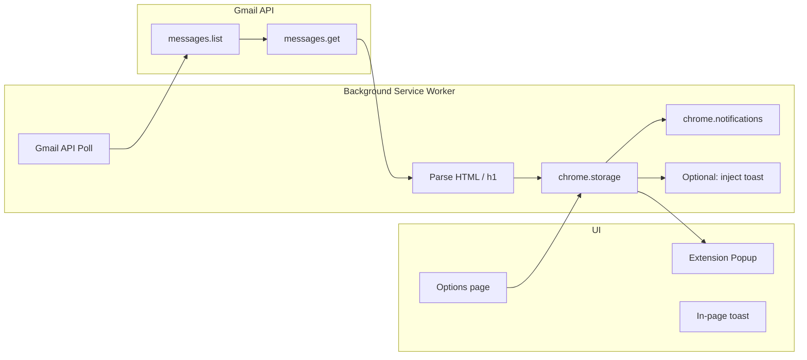

# Greenhouse Security Code Chrome Extension

## Reference and scope

- **Email source**: From `no-reply@us.greenhouse-mail.io`, subject contains "Security code for your application".
- **Code location**: The code is the text inside the first `<h1>` in the email body (see [greenhouse-security_code-1.html](gmail-helper/refs/greenhouse-security_code-1.html) lines 44–46: the paragraph says "Copy and paste this code..." then `<h1>lRoJ0Qkj</h1>`).
- **Project state**: [gmail-helper](gmail-helper) currently only has this ref HTML; the extension will be implemented from scratch under `gmail-helper/`.

---

## Architecture




- **Background**: Polls Gmail API, parses emails, stores last code, shows notification and optionally triggers toast.
- **Popup**: Reads last code from storage, shows it with a copy button.
- **Toast**: Injected into the **currently active tab** (any site—YouTube, GitHub, Gmail, etc.), so the code appears wherever the user is. Optional, position configurable in options. Requires optional host permission so injection works on any tab.
- **Options**: Gmail sign-in (OAuth), toast position, enable/disable notification vs toast, poll interval.

---

## 1. Manifest and permissions

**File**: `gmail-helper/manifest.json` (Manifest V3)

- **Permissions**: `identity`, `storage`, `notifications`, `clipboardWrite`, `scripting`, `offscreen`
- **Host permissions**: Required: `https://mail.google.com/*`, `https://www.googleapis.com/*`. **Optional**: `optional_permissions: ["<all_urls>"]` so the extension can inject the toast into the **active tab on any site** (not only Gmail). When the user enables "Show in-page toast" in options, call `chrome.permissions.request({ origins: ["<all_urls>"] })` so they grant "Allow access to all sites"; only then can the background script run `chrome.scripting.executeScript` on the current tab regardless of URL.
- **OAuth2**: In Google Cloud Console, create an OAuth 2.0 Client ID (Chrome app type), add the extension ID. In manifest, use `oauth2` with scopes including `https://www.googleapis.com/auth/gmail.readonly` and `https://www.googleapis.com/auth/gmail.modify` (modify only if you plan to mark as read; otherwise readonly is enough).
- **Background**: Single service worker script (e.g. `background.js`).
- **Popup**: `popup/popup.html` + `popup/popup.js`.
- **Options**: `options/options.html` + `options/options.js`.
- **Offscreen**: One offscreen document (e.g. `offscreen/offscreen.html` + `offscreen/offscreen.js`) used only for copying to clipboard from the background (required in MV3 when copying from a notification button click).

---

## 2. Gmail API integration (background) — prompt delivery

- **Auth**: Use `chrome.identity.getAuthToken({ interactive: true })` with the Gmail scope. Store token; refresh when needed. Options page can trigger sign-in (e.g. "Connect Gmail" button that calls `getAuthToken`).
- **Polling (prompt delivery)**:
  - **Shorter interval**: Default to **1 minute** (Chrome alarms minimum for recurring). Options: 1 min, 2 min. User can choose "Check frequently" for faster appearance when waiting for the code.
  - **"Check now" in popup**: Add a **"Check for new code"** / **"Refresh"** button in the popup that tells the background to run the poll **immediately**. When the user is waiting for the email, one click fetches the latest without waiting for the next alarm.
  - **Optional — fast mode when Gmail tab is active**: If the current tab is Gmail, use a 1‑minute alarm; when the user switches away, keep the same interval. Optionally, when Gmail tab is focused, the background can run an extra poll on a short timer (e.g. poll now, then again in 60 s) so the code appears soon after arrival while they're on Gmail.
  - On each run (alarm or "Check now"), call Gmail API:
    - `GET https://www.googleapis.com/gmail/v1/users/me/messages?q=from:no-reply@us.greenhouse-mail.io subject:Security code&maxResults=5`
    - For each message ID, fetch full message: `GET .../messages/{id}?format=full`
- **Parse body**: From `payload`, find the part with `mimeType: "text/html"` (if multipart); otherwise use `payload.body`. Decode `body.data` (base64url: replace `-`/`_` and use `atob`). Parse HTML (e.g. with `DOMParser` in an offscreen document or a small in-memory regex for the first `<h1>...</h1>`). Extract the inner text of the first `<h1>` as the security code.
- **Deduplication**: Keep the last-seen message ID (or a set of recent IDs) in `chrome.storage.local` so you only treat new messages as "new" and only then update the stored code and show notification/toast.
- **True push (optional, later)**: Gmail supports Pub/Sub push to a server; that would need a small backend and is out of scope here. The above keeps delivery prompt without a server.

---

## 3. Storing and using the code

- **Storage**: When a new code is extracted, save e.g. `{ lastCode: "lRoJ0Qkj", lastReceivedAt: <timestamp>, lastMessageId: "..." }` in `chrome.storage.local`.
- **Popup**: On open, read `lastCode` (and optionally `lastReceivedAt`) and show the code prominently with a "Copy" button. Include a **"Check for new code"** button that triggers an immediate Gmail poll so the user gets the code as soon as they click (no wait for the next scheduled poll). Copy can use `navigator.clipboard.writeText()` from the popup context (user gesture is available when they open the popup).

---

## 4. Desktop notification (Chrome / Windows)

- Use `chrome.notifications.create()` with:
  - Title: e.g. "Greenhouse security code"
  - Message: the code (or "Your code: XXXXX").
  - Buttons: e.g. `[{ title: "Copy" }]`.
- Listen for `chrome.notifications.onButtonClicked`. On "Copy":
  - Create an offscreen document if not already created (`chrome.offscreen.createDocument` with reason `"CLIPBOARD"` and the offscreen HTML path).
  - Send a message to the offscreen document with the code; the offscreen document calls `navigator.clipboard.writeText(code)` and replies.
  - Clear the notification after 2–3 seconds (or update the notification to "Copied!" then clear after 2–3 s).
- Optional: also handle `onClosed` to clean up.

---

## 5. In-page toast (any tab; configurable position)

- **Show on any tab**: The toast is shown on whichever tab is **currently active** when the new code arrives—whether the user is on Gmail, YouTube, GitHub, or any other site. This requires the optional host permission `<all_urls>`; the options page requests it when the user turns on "Show in-page toast" (and explains that the extension needs "access to all sites" only to display the toast on the current page).
- **Config**: No env vars in extensions. Use an **options page** and `chrome.storage.sync` (or `local`) to store:
  - `toastPosition`: e.g. `"topRight"` | `"topLeft"` | `"bottomRight"` | `"bottomLeft"` (or pixel values if you want).
  - `showToast`: boolean (show in-page toast when new code arrives).
  - `showDesktopNotification`: boolean.
- **When new code arrives**: If `showToast` is true, get the active tab with `chrome.tabs.query({ active: true, currentWindow: true })`. If the extension has access (optional `<all_urls>` granted), call `chrome.scripting.executeScript(tabId, { file: "inject/toast.js", args: [code, storedToastPosition] })` to inject the toast into that tab. If permission was not granted, skip injection (or show only the desktop notification).
- **Toast UI**: Injected script creates a small fixed-position div (top/right or from config), shows the code and a "Copy" button. On "Copy", use `navigator.clipboard.writeText(code)` in the page context, then auto-close the toast after 2–3 seconds (setTimeout + remove the node). Style so it’s clearly visible (e.g. card with shadow, monospace font for the code).
- **Position**: Map stored values (e.g. `topRight`) to CSS `top`/`right`/`bottom`/`left` in the injected script.

---

## 6. Copy from popup and auto-close behavior

- **Popup**: Copy button in popup uses `navigator.clipboard.writeText(lastCode)` then can show brief "Copied!" and optionally close the popup after 2–3 seconds (or leave it open; your requirement was mainly for the toast/notification).
- **Toast**: After user clicks Copy in the toast, dismiss the toast after 2–3 seconds as specified.
- **Notification**: After user clicks "Copy", show "Copied!" or similar and clear the notification after 2–3 seconds.

---

## 7. Options page

- **Gmail**: Button "Connect Gmail" that calls `chrome.identity.getAuthToken` (and optionally `chrome.identity.removeCachedAuthToken` for re-auth). Show connection status.
- **Preferences**: Checkboxes for "Show desktop notification when new code arrives", "Show in-page toast when new code arrives" (when enabling toast, request optional permission `<all_urls>` and explain: "Toast will appear on the tab you're currently viewing, on any website."). Dropdown or buttons for toast position (top-right, top-left, etc.). Optional: poll interval (e.g. 1, 2, 5 minutes) stored and used to set `chrome.alarms` period.

---

## 8. File structure (suggested)

```
gmail-helper/
  manifest.json
  background.js
  popup/
    popup.html
    popup.js
    popup.css
  options/
    options.html
    options.js
  offscreen/
    offscreen.html
    offscreen.js
  inject/
    toast.js          (injected script; receives code + position, builds DOM, Copy, auto-close)
  refs/
    greenhouse-security_code-1.html   (existing)
```

---

## 9. One-time setup (Google Cloud)

- Create a project in Google Cloud Console, enable Gmail API.
- Create OAuth 2.0 credentials → Application type "Chrome extension", add the extension ID (from `chrome://extensions` after loading unpacked).
- Copy the Client ID into `manifest.json` under `oauth2.client_id`.

---

## 10. Parsing detail (first `<h1>`)

From the ref HTML, the structure is a single main content block with one `<h1>` containing the code. When decoding the HTML from the Gmail API:

- Prefer finding the first `<h1>...</h1>` and taking its text content (e.g. regex or DOMParser). Fallback: if the email is plain text, you could use a simple pattern, but Greenhouse sends HTML, so the first `<h1>` is the reliable selector.

---

## Summary


| Requirement                            | Approach                                                                                                                                                                                                                 |
| -------------------------------------- | ------------------------------------------------------------------------------------------------------------------------------------------------------------------------------------------------------------------------ |
| Detect Greenhouse security-code emails | Gmail API polling (chrome.identity + alarms, default 1 min); "Check now" in popup for immediate check; filter by from + subject, parse HTML body for first `<h1>`                                                        |
| Show code with copy                    | Desktop: chrome.notifications with "Copy" button; copy via offscreen document. In-page: inject toast on **current tab (any site)** with Copy button; position from options; optional `<all_urls>` for any-tab injection. |
| Toast position configurable            | Options page → chrome.storage (no env; same idea as "configurable by env")                                                                                                                                               |
| Dismiss after copy (2–3 s)             | Notification: clear/update after 2–3 s. Toast: remove node after 2–3 s.                                                                                                                                                  |
| Extension icon click shows last code   | Popup reads last code from storage, shows code + Copy button                                                                                                                                                             |
| Windows desktop notification           | chrome.notifications on Windows shows as OS notification                                                                                                                                                                 |


If you want, the next step is to implement this structure under `gmail-helper/` (manifest, background, popup, options, offscreen, and inject toast script) and wire Gmail polling + parsing to the ref format in `greenhouse-security_code-1.html`.